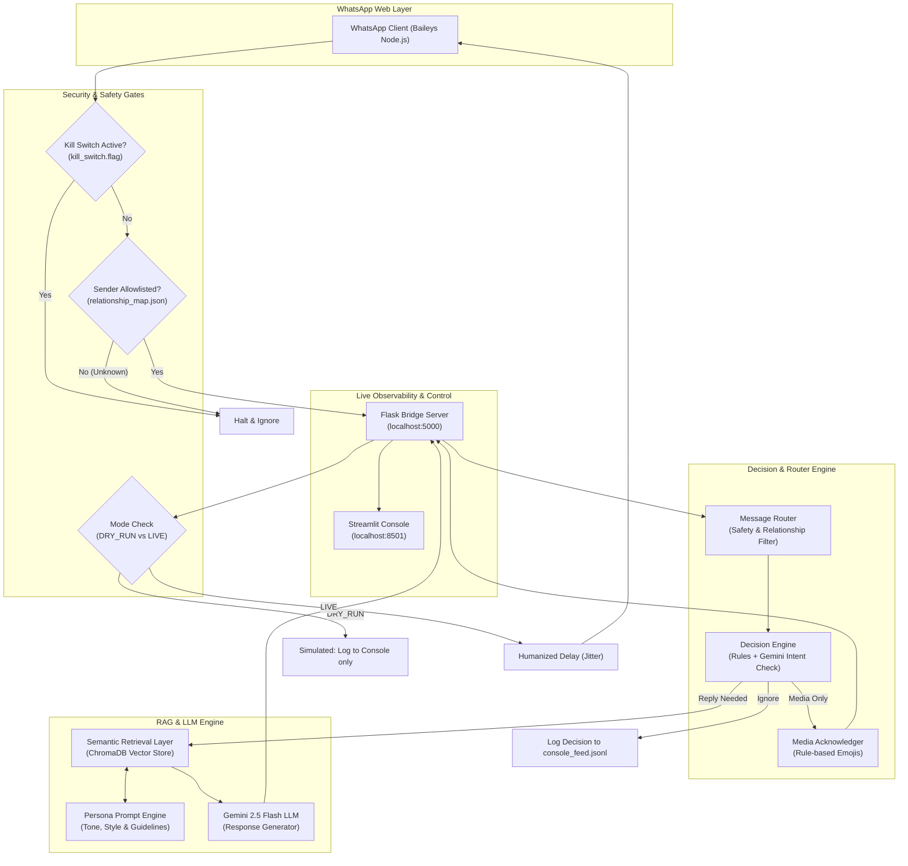

# WhatsApp Cruise Control ⚡

WhatsApp Cruise Control is a retrieval-grounded WhatsApp persona agent that autonomously handles incoming messages in your authentic communication style. Rather than acting as a generic AI chatbot, it pairs strict rule-based safety filtering with contextual RAG (Retrieval-Augmented Generation) trained on your real exported chats to mirror your exact tone, phrasing, Hinglish vocabulary, and relationship-specific nuances. It exercises judgment on when to reply, when to acknowledge media, and when to stay silent.

---

## 🏛️ System Architecture

The following pipeline illustrates how incoming WhatsApp messages flow through layered safety routers, decision gates, semantic retrieval, and persona generation:



---

## ⚙️ Setup Instructions

Follow these setup steps in order:

### 1. Environment Configuration

Create a `.env` file in the repository root containing your Google Gemini API key:

```env
GEMINI_API_KEY=your_gemini_api_key_here
```

### 2. Python Environment & Dependencies

Set up a Python virtual environment and install all dependencies:

```powershell
# Create Python virtual environment
python -m venv .venv

# Activate the virtual environment (Windows PowerShell)
.\.venv\Scripts\activate

# Install all required Python packages
pip install -r requirements.txt
```

*(Packages include: `chromadb[server]`, `sentence-transformers`, `torch`, `google-genai`, `python-dotenv`, `pytest`, `flask`, `streamlit`, and `streamlit-autorefresh`)*

### 3. Node.js Dependencies

Install the Baileys WhatsApp Web client and its dependencies:

```powershell
npm install
```

*(Packages include: `@whiskeysockets/baileys`, `axios`, `dotenv`, `pino`, and `qrcode-terminal`)*

---

## 🚀 Running the System

Open separate terminal windows and run each service in the following order:

### Terminal 1: ChromaDB Vector Database
Start the persistent Chroma vector store on port 8000:
```powershell
.\.venv\Scripts\chroma.exe run --path ./chroma_data --port 8000
```

> **Note:** If you haven't yet indexed your chat exports into ChromaDB, run the ingestion script once:
> ```powershell
> .\.venv\Scripts\python.exe ingestion/chunk_and_embed.py
> ```

### Terminal 2: Python Flask Bridge Server
Start the HTTP bridge connecting Baileys to the Python decision engine:
```powershell
.\.venv\Scripts\python.exe agent/bridge.py
```
*(Runs on `http://127.0.0.1:5000`)*

### Terminal 3: Streamlit Operations Console
Start the real-time monitoring and control dashboard:
```powershell
.\.venv\Scripts\streamlit.exe run console/app.py
```
*(Opens in your browser at `http://localhost:8501`)*

### Terminal 4: WhatsApp Baileys Client
Start the Baileys WhatsApp client:
```powershell
node whatsapp/baileys_client.js
```
- On first launch, a QR code will print in your terminal.
- **Scan the QR code using a dedicated/secondary WhatsApp number** (via WhatsApp > Linked Devices > Link a Device).
- Once connected, session credentials are saved locally in `./auth_info_baileys/` so you do not need to rescan every time.

---

## 🎛️ How to Use the Operations Console

The Streamlit dashboard (`console/app.py`) provides real-time observability and controls:

1. **Operating Mode (`DRY_RUN` vs `LIVE`):**
   - **`DRY_RUN (Simulation)`**: Incoming messages are evaluated, grounded against ChromaDB, and persona replies are generated and displayed on the console feed, but **never sent over WhatsApp**.
   - **`LIVE (Active Replies)`**: Responses are actively sent back over WhatsApp exclusively to contacts on your allowlist.
   - **Rule:** **Always start every fresh session in `DRY_RUN` mode** to verify decision quality and grounding retrieval traces before going live.

2. **Humanized Delay Range:**
   - Configure `min_delay_seconds` and `max_delay_seconds` in the sidebar.
   - Adds natural random jitter before sending each message so responses do not appear robotic or instantaneous.
   - Changes are atomically written to `config/settings.json`.

3. **Emergency Kill Switch:**
   - Click the prominent red **🛑 KILL SWITCH** button in the sidebar to halt all processing immediately.
   - Creates a `kill_switch.flag` file in the repo root.
   - A bright red warning banner will stay visible across the top of the dashboard. Both the Baileys client and the Python bridge will refuse to process or send any messages while engaged.
   - Click **Clear Kill Switch** to resume normal operations.

---

> [!CAUTION]
> ### ⚠️ USE RESPONSIBLY
> - **Terms of Service:** Baileys automates WhatsApp Web, which violates WhatsApp's Terms of Service.
> - **Dedicated Number Only:** Never run this project on your primary, personal, or business phone number. **Use only a dedicated secondary or test number.**
> - **Human-like Delays & Low Volume:** Keep message volume low and maintain conservative delay thresholds (`min_delay_seconds >= 3`, `max_delay_seconds >= 12`) to avoid triggering anti-spam automation detectors.
> - **Explicit Consent:** Only allowlist and interact with friends, family, or test contacts who have explicitly consented to talking to an automated persona agent.
> - **Ban Risk:** Aggressive, unattended, or unthrottled usage can result in your WhatsApp account being permanently banned.
